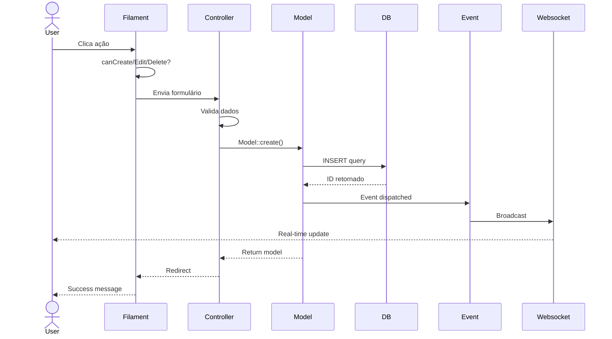
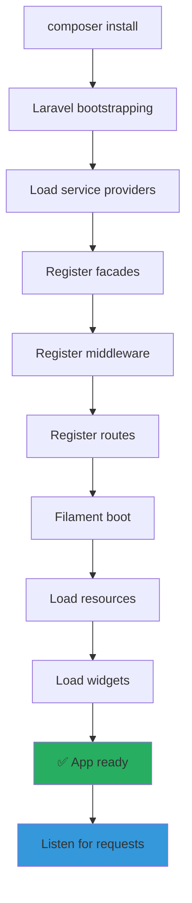
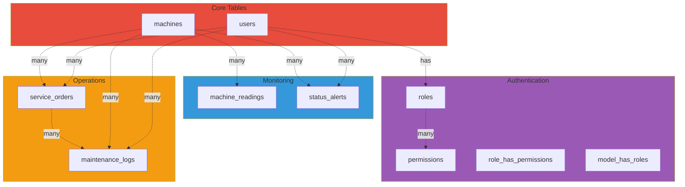
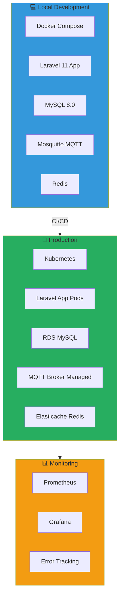
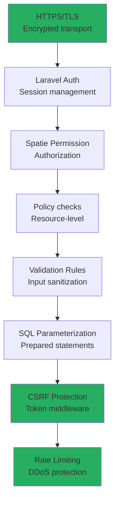
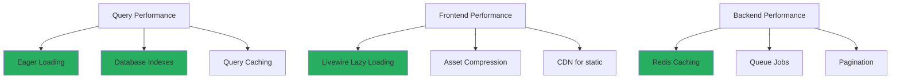
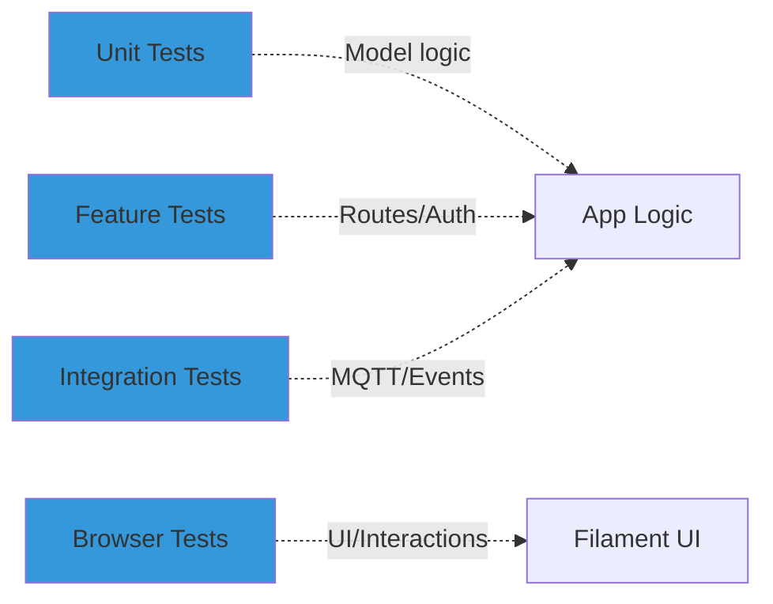

# 🏗️ Arquitetura Técnica Geral

## 🔧 Stack em Camadas

```mermaid
flowchart TD
    subgraph presentation["🎨 PRESENTATION LAYER"]
        UI["Filament Dashboard (UI)"]
        Resources["Resources + Forms"]
        Widgets["Widgets + Charts"]
    end

    subgraph application["⚙️ APPLICATION LAYER"]
        Controllers["Controllers"]
        Actions["Filament Actions"]
        Listeners["Event Listeners"]
        Commands["Artisan Commands"]
    end

    subgraph domain["📦 DOMAIN LAYER"]
        Models["Eloquent Models"]
        Traits["Traits + Scopes"]
        Events["Domain Events"]
        Rules["Validation Rules"]
    end

    subgraph infrastructure["🗄️ INFRASTRUCTURE LAYER"]
        DB["MySQL Database"]
        MQTT["MQTT Broker"]
        Storage["File Storage"]
    end

    presentation --> application
    application --> domain
    domain --> infrastructure

    style presentation fill:#3498db
    style application fill:#9b59b6
    style domain fill:#e74c3c
    style infrastructure fill:#34495e
```

---

## 📡 Componentes do Sistema

```mermaid
graph TB
    subgraph frontend["🖥️ Frontend"]
        F1["Filament Admin<br/>Laravel Packages"]
        F2["Livewire<br/>Real-time components"]
        F3["Alpine.js<br/>Lightweight interactions"]
    end

    subgraph backend["🔧 Backend"]
        B1["Laravel 11 Router"]
        B2["Filament Resources<br/>CRUD wrapper"]
        B3["Eloquent Models<br/>ORM"]
        B4["Spatie Permission<br/>RBAC"]
    end

    subgraph services["🌐 Services"]
        S1["MQTT Client<br/>ESP-32 connection"]
        S2["Event System<br/>Listeners"]
        S3["Queue Jobs<br/>Background tasks"]
        S4["Email Service<br/>Notifications"]
    end

    subgraph data["💾 Data"]
        D1["MySQL<br/>Relational DB"]
        D2["Redis<br/>Cache"]
        D3["File Storage<br/>Images, docs"]
    end

    subgraph external["🤖 External"]
        E1["ESP-32 Sensors<br/>IoT Devices"]
        E2["MQTT Broker<br/>Message Queue"]
    end

    F1 --> B1
    B1 --> B2
    B2 --> B3
    B3 --> D1
    B4 --> D1
    B2 --> S1
    S1 --> E2
    E2 --> E1
    S2 --> S4
    S3 --> D1
    B3 --> D2

    style frontend fill:#3498db
    style backend fill:#9b59b6
    style services fill:#e74c3c
    style data fill:#34495e
    style external fill:#2ecc71
```

---

## 🔄 Data Flow: Request Completo

---

## 🚀 Startup: Application Bootstrap

---

## 📊 Database Architecture

---

## 🔌 Integration Points

```mermaid
graph LR
    A["Laravel APP"] -.->|MQTT Publish| B["Mosquitto Broker"]
    E["ESP-32 Sensors"] -->|MQTT Publish| B
    B -->|MQTT Subscribe| A
    A -->|Events| C["Laravel Echo"]
    C -->|Broadcast| D["Filament Dashboard"]
    A -->|Mail Service| F["SMTP Server"]
    A -->|Cache| G["Redis"]

    style A fill:#9b59b6
    style B fill:#34495e
    style D fill:#3498db
    style E fill:#2ecc71
```

---

## 🎯 Deployment Architecture

---

## 🔐 Security Layers

---

## 📈 Performance Optimization

---

## 🧪 Testing Strategy

---

*[[DIAGRAMAS]] | [[Fluxo-Permissoes]]*
