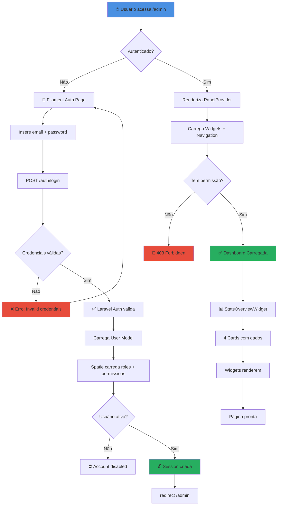
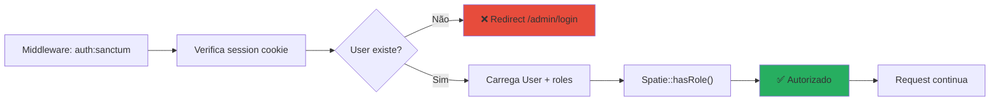

# 🎨 Fluxo de Autenticação e Login

## 🔐 Diagrama: Autenticação Filament + Spatie



---

## 🔄 Fluxo de Sessão



---

## 📋 Verificação de Permissões

```mermaid
flowchart TD
    A["Usuário clica em ação no Filament"] --> B["Filament chama canCreate/Edit/Delete"]
    B --> C["Gate ou Policy verifica"]
    C --> D{Auth::user()->hasRole()?}
    D -->|false| E["🚫 Ação desabilitada"]
    D -->|true| F["Spatie::hasPermissionTo()"]
    F --> G{Tem permissão?}
    G -->|false| H["403 Unauthorized"]
    G -->|true| I["✅ Executa controller"]
    I --> J["Model salvo ou deletado"]

    style E fill:#f39c12
    style H fill:#e74c3c
    style I fill:#27ae60
```

---

## 📊 Matrix de Acesso por Rota

| Rota | Admin | Gerente | Tecnico | Operador |
|------|:-----:|:-------:|:-------:|:--------:|
| `/admin` | ✅ | ✅ | ✅ | ✅ |
| `/admin/machines` (view) | ✅ | ✅ | ✅ | ✅ |
| `/admin/machines/create` | ✅ | ✅ | ❌ | ❌ |
| `/admin/machines/edit` | ✅ | ✅ | ❌ | ❌ |
| `/admin/service-orders` | ✅ | ✅ | ✅ | ✅ |
| `/admin/service-orders/create` | ✅ | ✅ | ✅ | ❌ |
| `/admin/users` | ✅ | ❌ | ❌ | ❌ |

---

*[[DIAGRAMAS]] | [[Fluxo-Ordem-Serviço]]*
