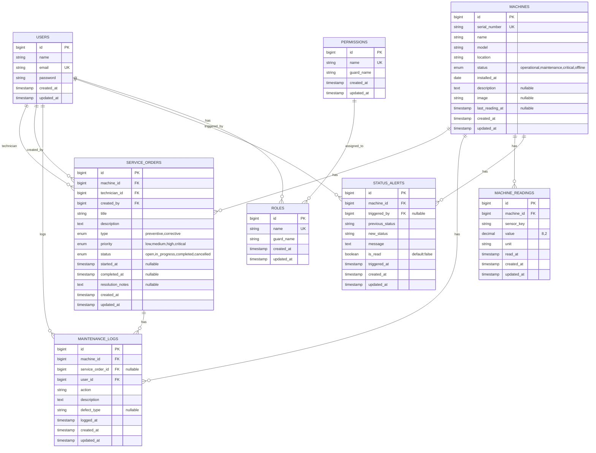

# 08 - Diagrama de Entidade-Relacionamento

## 📊 ER Diagram (Mermaid)



---

## 🔄 Relacionamentos Detalhados

### Users → ServiceOrders (duplo)
- **technician_id**: Um usuário pode ter múltiplas O.S. como técnico atribuído
- **created_by**: Um usuário pode criar múltiplas O.S.

**Query exemplo:**
```php
$user->serviceOrders; // O.S. onde o user é technician_id
$user->createdServiceOrders; // O.S. criadas pelo user
```

---

### Machines → ServiceOrders
Uma máquina pode ter múltiplas ordens de serviço

**Query exemplo:**
```php
$machine->serviceOrders; // All O.S. para essa máquina
$machine->serviceOrders()->where('status', 'completed')->count();
```

---

### Machines → MaintenanceLogs
Uma máquina pode ter múltiplos logs de intervenção

**Query exemplo:**
```php
$machine->maintenanceLogs; // All logs
$machine->maintenanceLogs()->where('defect_type', 'corrosion')->get();
```

---

### ServiceOrders → MaintenanceLogs
Uma O.S. pode ter múltiplos logs (uma intervenção pode gerar vários registros)

**Query exemplo:**
```php
$serviceOrder->maintenanceLogs; // Todos os logs dessa O.S.
```

---

### Machines → MachineReadings
Leitura de sensores de uma máquina (futuro: dados de ESP-32)

**Query exemplo:**
```php
$machine->readings()->where('sensor_key', 'temperature')->latest()->first();
```

---

### Machines → StatusAlerts
Histórico de mudanças de status de uma máquina

**Query exemplo:**
```php
$machine->alerts()->where('is_read', false)->count(); // Alertas não lidos
```

---

## 📋 Principais Índices (Performance)

```sql
-- machines
ALTER TABLE machines ADD INDEX idx_status (status);
ALTER TABLE machines ADD INDEX idx_location (location);
ALTER TABLE machines ADD FULLTEXT INDEX ft_name (name);

-- service_orders
ALTER TABLE service_orders ADD INDEX idx_machine_id (machine_id);
ALTER TABLE service_orders ADD INDEX idx_technician_id (technician_id);
ALTER TABLE service_orders ADD INDEX idx_status (status);
ALTER TABLE service_orders ADD INDEX idx_type (type);

-- maintenance_logs
ALTER TABLE maintenance_logs ADD INDEX idx_machine_id (machine_id);
ALTER TABLE maintenance_logs ADD INDEX idx_defect_type (defect_type);
ALTER TABLE maintenance_logs ADD INDEX idx_logged_at (logged_at);

-- machine_readings
ALTER TABLE machine_readings ADD INDEX idx_machine_id (machine_id);
ALTER TABLE machine_readings ADD INDEX idx_read_at (read_at);

-- status_alerts
ALTER TABLE status_alerts ADD INDEX idx_machine_id (machine_id);
ALTER TABLE status_alerts ADD INDEX idx_is_read (is_read);
ALTER TABLE status_alerts ADD INDEX idx_triggered_at (triggered_at);
```

---

## 🔐 Constraints e Integridade

### Cascade DELETE
- `machines` → `service_orders` (ON DELETE CASCADE)
- `machines` → `maintenance_logs` (ON DELETE CASCADE)
- `machines` → `machine_readings` (ON DELETE CASCADE)
- `machines` → `status_alerts` (ON DELETE CASCADE)

### SET NULL
- `service_orders.service_order_id` → null se O.S. deletada
- `status_alerts.triggered_by` → null se usuário deletado

### RESTRICT
- Não permite deletar um User que tenha service_orders ou logs associados

---

## 📊 Queries Comuns

### Máquinas em Estado Crítico com O.S. Abertas

```php
$criticalWithOpenOrders = Machine::where('status', 'critical')
    ->whereHas('serviceOrders', function ($query) {
        $query->where('status', '!=', 'completed');
    })
    ->get();
```

---

### Histórico Completo de Uma Máquina

```php
$history = Machine::find($machineId)
    ->maintenanceLogs()
    ->with('user', 'serviceOrder')
    ->orderBy('logged_at', 'DESC')
    ->get();
```

---

### Técnico com Mais O.S. Completadas

```php
$topTechnician = User::withCount('serviceOrders')
    ->where('serviceOrders.status', 'completed')
    ->orderBy('service_orders_count', 'DESC')
    ->first();
```

---

### Defetos Recorrentes

```php
$recurringDefects = MaintenanceLog::where('defect_type', '!=', null)
    ->groupBy('defect_type')
    ->selectRaw('defect_type, COUNT(*) as count')
    ->orderBy('count', 'DESC')
    ->get();
```

---

---

*[[_Documentação/README]] | [[_Documentação/07-Checklist]]*

---

## 🔗 Chave Estrangeira (FK) Constraints

| Foreign Key | References | Delete Action | Notes |
|-------------|-----------|---|---|
| service_orders.machine_id | machines.id | CASCADE | O.S. deletada com máquina |
| service_orders.technician_id | users.id | RESTRICT | Impede deletar user sem reatribuir O.S. |
| service_orders.created_by | users.id | RESTRICT | Impede deletar user criador |
| maintenance_logs.machine_id | machines.id | CASCADE | Logs deletados com máquina |
| maintenance_logs.service_order_id | service_orders.id | SET NULL | Preserva log mesmo se O.S. deletada |
| maintenance_logs.user_id | users.id | RESTRICT | Preserva auditoria |
| machine_readings.machine_id | machines.id | CASCADE | Readings deletadas com máquina |
| status_alerts.machine_id | machines.id | CASCADE | Alertas deletados com máquina |
| status_alerts.triggered_by | users.id | SET NULL | Preserva alerta mesmo se user deletado |

---

## 📑 Índices para Performance

| Tabela | Índice | Tipo | Propósito |
|--------|--------|------|----------|
| machines | idx_status | INDEX | Queries por status (scopes) |
| machines | idx_location | INDEX | Filtros por localização |
| machines | uk_serial_number | UNIQUE | Enforça unicidade |
| service_orders | idx_machine_id | INDEX | Relação com máquina |
| service_orders | idx_technician_id | INDEX | Atribuição |
| service_orders | idx_status | INDEX | Queries de estado |
| maintenance_logs | idx_machine_id | INDEX | Relação |
| maintenance_logs | idx_defect_type | INDEX | Análise de padrões |
| machine_readings | idx_machine_id | INDEX | Sensores por máquina |
| status_alerts | idx_is_read | INDEX | Widget de alertas |

---

## 🔍 Queries SQL Essenciais

### Dashboard Stats
```sql
SELECT
    COUNT(*) as total_machines,
    COUNT(CASE WHEN status = 'operational' THEN 1 END) as operational,
    COUNT(CASE WHEN status = 'critical' THEN 1 END) as critical
FROM machines;
```

### O.S. Abertas
```sql
SELECT so.*, m.name, u.name as technician
FROM service_orders so
JOIN machines m ON so.machine_id = m.id
LEFT JOIN users u ON so.technician_id = u.id
WHERE so.status IN ('open', 'in_progress')
ORDER BY so.priority DESC;
```

### Histórico de Máquina
```sql
SELECT ml.*, u.name, so.title
FROM maintenance_logs ml
JOIN users u ON ml.user_id = u.id
LEFT JOIN service_orders so ON ml.service_order_id = so.id
WHERE ml.machine_id = ?
ORDER BY ml.logged_at DESC;
```

---

## 📈 Normalização (3NF)

✅ **1NF:** Atomicidade garantida
✅ **2NF:** Sem dependências parciais
✅ **3NF:** Sem dependências transitivas

---

*Diagrama ER — MaintSys v1.0 — Expandido*
*Com constraints, índices e queries SQL*
*2026-04-03*
