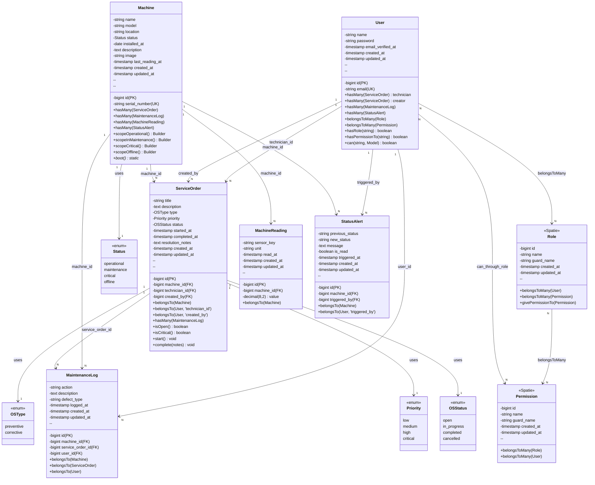

# 📐 Diagrama de Classes — Mermaid

## 🎨 UML Class Diagram (Mermaid)



---

## 📋 Legenda

| Símbolo | Significado |
|---------|-----------|
| `-` | Private attribute/method |
| `+` | Public method |
| `FK` | Foreign Key (Banco de dados) |
| `PK` | Primary Key |
| `UK` | Unique Key |
| `*` | Static method (boot) |
| `N` | Um para muitos |
| `<<enum>>` | Enumeration |
| `<<Spatie>>` | From Spatie package |

---

## 🔗 Relacionamentos Explicados

### 1:N (One-to-Many)
```
User (1) ──→ (N) ServiceOrder
   ↳ Um user pode ter múltiplas O.S. como técnico
```

### N:N (Many-to-Many)
```
User (N) ↔ (N) Role
   ↳ Um user pode ter múltiplos roles
   ↳ Um role pode ter múltiplos users
   ↳ Pivot table: role_user
```

### Inheritance/Polymorphism
```
Permission ← Role
Permission ← User (direct assignment)
   ↳ Spatie allows both role-based and direct permissions
```

---

## 🎯 Padrões de Design

### Model Relationships
```php
// Eloquent relationships (BelongsTo, HasMany, BelongsToMany)
// Todas as relações mapeadas no diagrama acima
```

### Boot Hooks
```php
// Machine::boot() cria StatusAlert automaticamente
protected static function boot() {
    parent::boot();
    static::updating(function ($machine) {
        if ($machine->isDirty('status')) {
            // Create StatusAlert
        }
    });
}
```

### Scopes
```php
// Query builder shortcuts
Machine::operational() // WHERE status = 'operational'
Machine::critical()    // WHERE status = 'critical'
```

### Methods
```php
ServiceOrder::start()      // Mark as in_progress
ServiceOrder::complete()   // Mark as completed
User::hasRole()           // Check Spatie role
```

---

## 📊 Multiplicidade das Relações

| Source       | →   | Target                 | Relation Type | SQL FK                        | Delete   |
| ------------ | --- | ---------------------- | ------------- | ----------------------------- | -------- |
| User         | 1:N | ServiceOrder (tech)    | HasMany       | technician_id                 | RESTRICT |
| User         | 1:N | ServiceOrder (creator) | HasMany       | created_by                    | RESTRICT |
| User         | 1:N | MaintenanceLog         | HasMany       | user_id                       | RESTRICT |
| User         | 1:N | StatusAlert            | HasMany       | triggered_by                  | SET NULL |
| Machine      | 1:N | ServiceOrder           | HasMany       | machine_id                    | CASCADE  |
| Machine      | 1:N | MaintenanceLog         | HasMany       | machine_id                    | CASCADE  |
| Machine      | 1:N | MachineReading         | HasMany       | machine_id                    | CASCADE  |
| Machine      | 1:N | StatusAlert            | HasMany       | machine_id                    | CASCADE  |
| ServiceOrder | 1:N | MaintenanceLog         | HasMany       | service_order_id              | SET NULL |
| User         | N:N | Role                   | BelongsToMany | (pivot: role_user)            | Detach   |
| Role         | N:N | Permission             | BelongsToMany | (pivot: role_has_permissions) | Detach   |

---

*Diagrama de Classes (UML) — MaintSys v1.0*
*Mermaid Class Diagram com todas as relações Eloquent*
*2026-04-03*
