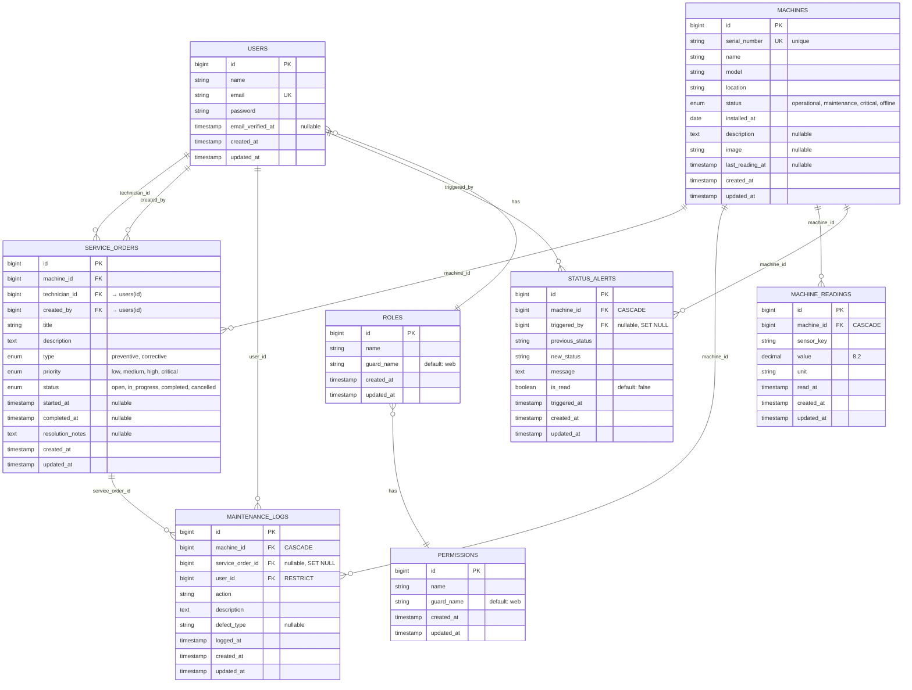

# 🗄️ Diagrama ER (Entity-Relationship) — Mermaid

## 📊 ER Diagram Completo



---

## 📋 Tabelas Detalhadas

### 👤 USERS

**Propósito:** Armazenar usuários do sistema

| Coluna | Tipo | Constraint | Notas |
|--------|------|-----------|-------|
| id | BIGINT | PK | Auto-increment |
| name | VARCHAR(255) | NOT NULL | Nome completo |
| email | VARCHAR(255) | UNIQUE, NOT NULL | Email único |
| password | VARCHAR(255) | NOT NULL | Hash bcrypt |
| email_verified_at | TIMESTAMP | NULLABLE | Verificação email |
| created_at | TIMESTAMP | NOT NULL | Audit |
| updated_at | TIMESTAMP | NOT NULL | Audit |

**Índices:**
- PK: id
- UK: email
- FK(in): role_user, maintenance_logs, service_orders, status_alerts

---

### 🛡️ ROLES (Spatie)

**Propósito:** Definir roles (admin, gerente, tecnico, operador)

| Coluna | Tipo | Valor |
|--------|------|-------|
| id | BIGINT | PK |
| name | VARCHAR(125) | 'admin', 'gerente', 'tecnico', 'operador' |
| guard_name | VARCHAR(125) | 'web' |
| created_at | TIMESTAMP | now() |
| updated_at | TIMESTAMP | now() |

**Pivot:** role_user (N:N com users)

---

### 🔐 PERMISSIONS (Spatie)

**Propósito:** Definir permissões granulares

| Coluna | Tipo | Exemplos |
|--------|------|----------|
| id | BIGINT | PK |
| name | VARCHAR(125) | 'machine.create', 'machine.update', 'machine.delete' |
| guard_name | VARCHAR(125) | 'web' |

**Pivot:** role_has_permissions (N:N com roles)

---

### 🏢 MACHINES

**Propósito:** Representar máquinas industriais

| Coluna | Tipo | Constraint | Notas |
|--------|------|-----------|-------|
| id | BIGINT | PK | |
| serial_number | VARCHAR(50) | UNIQUE | Ex: SN-2024-001 |
| name | VARCHAR(255) | NOT NULL | |
| model | VARCHAR(100) | NOT NULL | |
| location | VARCHAR(255) | NOT NULL | Ex: Galpão A - Linha 3 |
| status | ENUM | DEFAULT 'operational' | 4 estados |
| installed_at | DATE | NOT NULL | |
| description | TEXT | NULLABLE | |
| image | VARCHAR(255) | NULLABLE | File path |
| last_reading_at | TIMESTAMP | NULLABLE | Último sensor |
| created_at | TIMESTAMP | NOT NULL | |
| updated_at | TIMESTAMP | NOT NULL | |

**Índices:**
```
INDEX idx_status (status)           -- Scopes
INDEX idx_location (location)       -- Filtros
UNIQUE KEY uk_serial_number (serial_number)
```

**Boot Hook:** Cria StatusAlert ao mudar status

---

### 📋 SERVICE_ORDERS

**Propósito:** Rastrear ordens de manutenção

| Coluna | Tipo | FK / Constraint | Notas |
|--------|------|---|---|
| id | BIGINT | PK | |
| machine_id | BIGINT | FK → machines(id) CASCADE | |
| technician_id | BIGINT | FK → users(id) RESTRICT | Técnico assignado |
| created_by | BIGINT | FK → users(id) RESTRICT | Gerente criador |
| type | ENUM | NOT NULL | 'preventive'/'corrective' |
| priority | ENUM | DEFAULT 'medium' | low/medium/high/critical |
| status | ENUM | DEFAULT 'open' | open/in_progress/completed/cancelled |
| title | VARCHAR(255) | NOT NULL | |
| description | TEXT | NOT NULL | |
| started_at | TIMESTAMP | NULLABLE | Quando técnico iniciou |
| completed_at | TIMESTAMP | NULLABLE | Quando concluída |
| resolution_notes | TEXT | NULLABLE | Notas de resolução |
| created_at | TIMESTAMP | NOT NULL | |
| updated_at | TIMESTAMP | NOT NULL | |

**Índices:**
```
INDEX idx_machine_id (machine_id)
INDEX idx_technician_id (technician_id)
INDEX idx_status (status)           -- Para widget
INDEX idx_type (type)               -- Filtros
```

**State Machine:**
```
open → in_progress → completed
       ↓
       cancelled
```

---

### 📝 MAINTENANCE_LOGS

**Propósito:** Histórico de manutenção (auditoria)

| Coluna | Tipo | FK / Constraint | Notas |
|--------|------|---|---|
| id | BIGINT | PK | |
| machine_id | BIGINT | FK → machines(id) CASCADE | |
| service_order_id | BIGINT | FK → service_orders(id) SET NULL nullable | |
| user_id | BIGINT | FK → users(id) RESTRICT | Técnico que registrou |
| action | VARCHAR(255) | NOT NULL | Ex: "Troca de correia" |
| description | TEXT | NOT NULL | Descrição detalhada |
| defect_type | VARCHAR(100) | NULLABLE | Ex: "Desgaste" para análise |
| logged_at | TIMESTAMP | NOT NULL | Quando registrado |
| created_at | TIMESTAMP | NOT NULL | |
| updated_at | TIMESTAMP | NOT NULL | |

**Índices:**
```
INDEX idx_machine_id (machine_id)
INDEX idx_defect_type (defect_type) -- Padrões
INDEX idx_logged_at (logged_at)     -- Range queries
```

**Regra Importante:** Nunca deletar (!!) — auditoria

---

### 📊 MACHINE_READINGS

**Propósito:** Leituras de sensores (preparação MQTT)

| Coluna | Tipo | FK / Constraint | Notas |
|--------|------|---|---|
| id | BIGINT | PK | |
| machine_id | BIGINT | FK → machines(id) CASCADE | |
| sensor_key | VARCHAR(50) | NOT NULL | 'temperature', 'vibration', etc |
| value | DECIMAL(8,2) | NOT NULL | Ex: 42.50 |
| unit | VARCHAR(50) | NOT NULL | '°C', 'mm/s', 'RPM', 'bar' |
| read_at | TIMESTAMP | NOT NULL | Quando lido |
| created_at | TIMESTAMP | NOT NULL | |
| updated_at | TIMESTAMP | NOT NULL | |

**Exemplos:**
```
sensor_key: 'temperature', value: 42.5, unit: '°C'
sensor_key: 'vibration', value: 2.3, unit: 'mm/s'
sensor_key: 'rpm', value: 1500, unit: 'RPM'
sensor_key: 'pressure', value: 3.2, unit: 'bar'
```

---

### 🚨 STATUS_ALERTS

**Propósito:** Notificações de mudança de status

| Coluna | Tipo | FK / Constraint | Notas |
|--------|------|---|---|
| id | BIGINT | PK | |
| machine_id | BIGINT | FK → machines(id) CASCADE | |
| triggered_by | BIGINT | FK → users(id) SET NULL nullable | Admin que mudou |
| previous_status | VARCHAR(50) | NOT NULL | Status anterior |
| new_status | VARCHAR(50) | NOT NULL | Status novo |
| message | TEXT | NOT NULL | "Máquina X mudou de..." |
| is_read | BOOLEAN | DEFAULT FALSE | Lido pelo gerente? |
| triggered_at | TIMESTAMP | NOT NULL | Quando criado |
| created_at | TIMESTAMP | NOT NULL | |
| updated_at | TIMESTAMP | NOT NULL | |

**Índices:**
```
INDEX idx_machine_id (machine_id)
INDEX idx_is_read (is_read)         -- Widget alertas
INDEX idx_triggered_at (triggered_at)
```

**Trigger:** Auto-criado via boot hook no Model Machine

---

## 🔗 Foreign Keys com Delete Actions

| FK | Referência | Delete | Justificativa |
|----|-----------|--------|---|
| service_orders.machine_id | machines.id | CASCADE | O.S. deve ser deletada com máquina |
| service_orders.technician_id | users.id | RESTRICT | Impede deletar user com O.S. ativa |
| service_orders.created_by | users.id | RESTRICT | Preserva criador em auditoria |
| maintenance_logs.machine_id | machines.id | CASCADE | Logs deletados com máquina |
| maintenance_logs.service_order_id | service_orders.id | SET NULL | Preserva log mesmo se O.S. deletada |
| maintenance_logs.user_id | users.id | RESTRICT | Preserva auditoria |
| machine_readings.machine_id | machines.id | CASCADE | Readings deletadas com máquina |
| status_alerts.machine_id | machines.id | CASCADE | Alertas deletados com máquina |
| status_alerts.triggered_by | users.id | SET NULL | Preserva alerta |

---

## 📈 Índices por Performance

| Tabela | Índice | Tipo | Propósito |
|--------|--------|------|----------|
| machines | idx_status | INDEX | Scopes operational(), critical() |
| machines | idx_location | INDEX | Filtros por localização |
| machines | uk_serial_number | UNIQUE | Enforça unicidade |
| service_orders | idx_machine_id | INDEX | JOINs e relação |
| service_orders | idx_technician_id | INDEX | Atribuição por técnico |
| service_orders | idx_status | INDEX | Dashboard queries |
| maintenance_logs | idx_machine_id | INDEX | Histórico por máquina |
| maintenance_logs | idx_defect_type | INDEX | Análise de padrões |
| machine_readings | idx_machine_id | INDEX | Sensores por máquina |
| machine_readings | idx_read_at | INDEX | Range queries time-series |
| status_alerts | idx_is_read | INDEX | Widget alertas não-lidos |
| status_alerts | idx_triggered_at | INDEX | Ordem temporal |

---

## 🎯 Constraints de Integridade

### Domain Rules
1. `serial_number` — Único e imutável
2. `status` — Só alterável por Admin/Gerente (via Policy)
3. `type` — Obrigatório ('preventive' ou 'corrective')
4. `resolution_notes` — Obrigatório quando status='completed'

### Business Rules
1. Técnico só vê/edita próprias O.S.
2. Gerente pode delegar O.S. para técnicos
3. Admin tem acesso irrestrito
4. StatusAlert criada auto ao mudar Machine.status
5. MaintenanceLog nunca deletado

### Validation Rules
1. Machine deve existir antes de O.S./Log
2. Técnico deve ter role 'tecnico'
3. Email válido e único
4. completed_at > started_at > created_at

---

## 📊 Normalization (3NF)

✅ **1NF** — Atomicidade: Cada coluna tem valor atômico
✅ **2NF** — Sem dependências parciais
✅ **3NF** — Sem dependências transitivas

---

*Diagrama ER (Entity-Relationship) — MaintSys v1.0*
*Mermaid ER Diagram com todas as tabelas e relações*
*2026-04-03*
