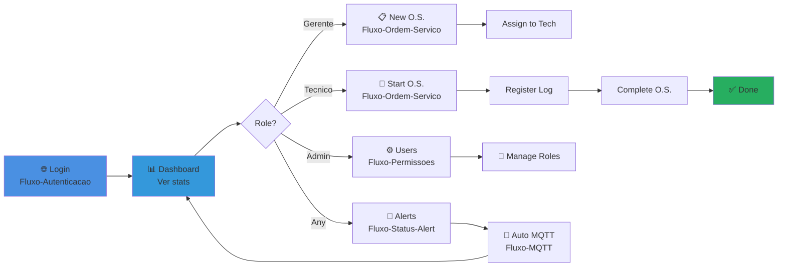

# 🎨 DIAGRAMAS - Índice Visual

## 📚 Mapa Interativo do projeto MaintSys

Todos os fluxogramas, diagramas ER e arquitetura em um único lugar.

---

## 🔐 **FLUXO DE AUTENTICAÇÃO**

```
┌─────────────────────────────────────┐
│   [[Fluxo-Autenticacao]]   │
│                                       │
│  • Login → Session → Dashboard      │
│  • Middleware auth:sanctum          │
│  • Spatie roles check               │
│  • Permissões por rota              │
│                                       │
└─────────────────────────────────────┘
```

**Diagrama:** User login → Filament Auth → Session → Dashboard
**Conceitos:** Middleware, Spatie Permission, Gate/Policy

---

## 🔧 **FLUXO DE ORDEM DE SERVIÇO**

```
┌─────────────────────────────────────┐
│  [[Fluxo-Ordem-Servico]]  │
│                                       │
│  • Gerente cria O.S.                │
│  • Técnico inicia manutenção        │
│  • Registra maintenance log         │
│  • Conclui com resolution_notes     │
│  • State machine: aberta→ prog→ fim │
│                                       │
└─────────────────────────────────────┘
```

**Diagramas:**
- Criação de O.S.
- Técnico inicia O.S.
- Registra Maintenance Log
- Conclusão com notas
- State machine (open → in_progress → completed)

---

## 🚨 **FLUXO DE ALERTAS DE STATUS**

```
┌─────────────────────────────────────┐
│  [[Fluxo-Status-Alert]]    │
│                                       │
│  • Gerente muda status máquina      │
│  • Boot hook cria StatusAlert       │
│  • Notificação enviada              │
│  • Alerta aparece no Dashboard      │
│  • User marca como "Lido"           │
│                                       │
└─────────────────────────────────────┘
```

**Diagramas:**
- Mudança de status → StatusAlert
- Notificação Filament
- CriticalAlertsWidget atualiza
- Toggle "Marcar como lido"
- Timeline de transições

---

## 📡 **FLUXO DE MQTT & IoT**

```
┌─────────────────────────────────────┐
│     [[Fluxo-MQTT]]         │
│                                       │
│  • ESP-32 envia dados via MQTT      │
│  • Laravel listener recebe          │
│  • MachineReading salva             │
│  • Detecção de anomalias            │
│  • Websocket → Dashboard real-time  │
│                                       │
└─────────────────────────────────────┘
```

**Diagramas:**
- Arquitetura ESP-32 → MQTT → Laravel
- Listener processa payload
- Detecção automática de anomalias
- Dashboard real-time com websockets
- Configuração .env e testing

---

## 🛡️ **FLUXO DE PERMISSÕES**

```
┌─────────────────────────────────────┐
│   [[Fluxo-Permissoes]]     │
│                                       │
│  • Middleware stack (auth/verify)   │
│  • Role hierarchy                   │
│  • Policy authorization             │
│  • CRUD permissions by role         │
│  • Test checklist                   │
│                                       │
└─────────────────────────────────────┘
```

**Diagramas:**
- Request → Middleware → Authorization
- Role hierarchy (Admin → Gerente → Tecnico → Operador)
- Policy check flow
- Resource protection
- Gates vs Policies

---

## 🏗️ **ARQUITETURA TÉCNICA**

```
┌─────────────────────────────────────┐
│ [[_Documentação/Arquitetura-Tecnica]]    │
│                                       │
│  • Stack em camadas                 │
│  • Componentes do sistema           │
│  • Data flow completo               │
│  • Database architecture            │
│  • Integration points               │
│  • Deployment patterns              │
│                                       │
└─────────────────────────────────────┘
```

**Diagramas:**
- Apresentação → Aplicação → Domínio → Infraestrutura
- Frontend/Backend/Services/Data
- Sequência diagrama
- MySQL schema com relacionamentos
- HTTPS/TLS/Auth/CSRF layers
- Performance optimization

---

## 📊 **DIAGRAMA ER (Banco de Dados)**

```
┌─────────────────────────────────────┐
│   [[_Documentação/08-Diagrama-ER]]       │
│                                       │
│  • 6 Tabelas principais             │
│  • Relacionamentos Eloquent         │
│  • Índices e performance            │
│  • Constraints e integridade        │
│  • Queries comuns                   │
│                                       │
└─────────────────────────────────────┘
```

**Mermaid ER Diagram:**
- Entities: User, Machine, ServiceOrder, MaintenanceLog, MachineReading, StatusAlert
- Relationships: hasMany, belongsTo
- FK constraints, indexes

---

## 🗺️ **MAPA DE NAVEGAÇÃO VISUAL**

```
                    ┌──────────────────┐
                    │   DASHBOARD      │
                    │  (Home Page)     │
                    └──────────────────┘
                            │
            ┌───────────────┼───────────────┐
            │               │               │
       ┌─────────┐    ┌──────────┐    ┌─────────┐
       │Machines │    │ Service  │    │ Status  │
       │         │    │ Orders   │    │ Alerts  │
       └─────────┘    └──────────┘    └─────────┘
            │               │               │
            │               │               │
       ┌────────────────────────────────────┐
       │  Maintenance Logs                  │
       │  (Relation Manager)                │
       └────────────────────────────────────┘
            │
       ┌────────────────────────────────────┐
       │  Admin - Users & Roles             │
       │  (Only Admin access)               │
       └────────────────────────────────────┘
```

---

## 🎯 **Fluxo USER JOURNEY**



---

## 📋 **Checklist: Todos os Fluxos Implementados**

- [ ] **Autenticação** ([[Fluxo-Autenticacao]])
  - [ ] Login
  - [ ] Session management
  - [ ] Logout

- [ ] **Ordem de Serviço** ([[Fluxo-Ordem-Servico]])
  - [ ] Criar O.S.
  - [ ] Iniciar O.S.
  - [ ] Registrar log
  - [ ] Concluir O.S.

- [ ] **Alertas** ([[Fluxo-Status-Alert]])
  - [ ] Mudança status → alert
  - [ ] Notificação enviada
  - [ ] Widget atualiza
  - [ ] Marcar como lido

- [ ] **MQTT/IoT** ([[Fluxo-MQTT]])
  - [ ] ESP-32 publisher
  - [ ] Laravel listener
  - [ ] Detecção anomalias
  - [ ] Dashboard real-time

- [ ] **Permissões** ([[Fluxo-Permissoes]])
  - [ ] 4 Roles criadas
  - [ ] Policies implementadas
  - [ ] Resources protegidos

- [ ] **Arquitetura** ([[_Documentação/Arquitetura-Tecnica]])
  - [ ] Stack em camadas
  - [ ] Componentes documentados
  - [ ] Integration points
  - [ ] Deployment ready

---

## 🔗 Links Rápidos

| Fluxo | Tipo | Status |
|-------|------|--------|
| [[Fluxo-Autenticacao]] | 🔐 Auth | ✅ Implementado |
| [[Fluxo-Ordem-Servico]] | 📋 Business | ✅ Implementado |
| [[Fluxo-Status-Alert]] | 🚨 Notifications | ✅ Implementado |
| [[Fluxo-MQTT]] | 📡 IoT | 📋 Futuro |
| [[Fluxo-Permissoes]] | 🛡️ Security | ✅ Implementado |
| [[_Documentação/Arquitetura-Tecnica]] | 🏗️ System | ✅ Especificado |

---

## 📖 Como Ler os Diagramas

### Cores Padrão
- 🔵 **Azul** = Ação do usuário / Input
- 🟠 **Laranja** = Processamento / Em andamento
- 🟢 **Verde** = Sucesso / Aprovado
- 🔴 **Vermelho** = Erro / Bloqueado
- 🟣 **Roxo** = Background / Service
- ⚫ **Cinza** = Dados / Storage

### Setas
- `→` = Fluxo normal
- `-.->` = Relação / Referência
- `|` = Decisão (diamond)

---

## 🚀 Próximos Passos

1. **Revisar cada fluxo** com a equipe
2. **Validar permissões** em cada resource
3. **Testes de integração** (MQTT, Websockets)
4. **Documentar exceções** (edge cases)
5. **Diagrama de erro handling**

---

*Documentação de Fluxos - MaintSys v1.0*
*Atualizado: 2026-04-03*

---

Clique em um dos links acima para ver o fluxograma detalhado! ⬆️
