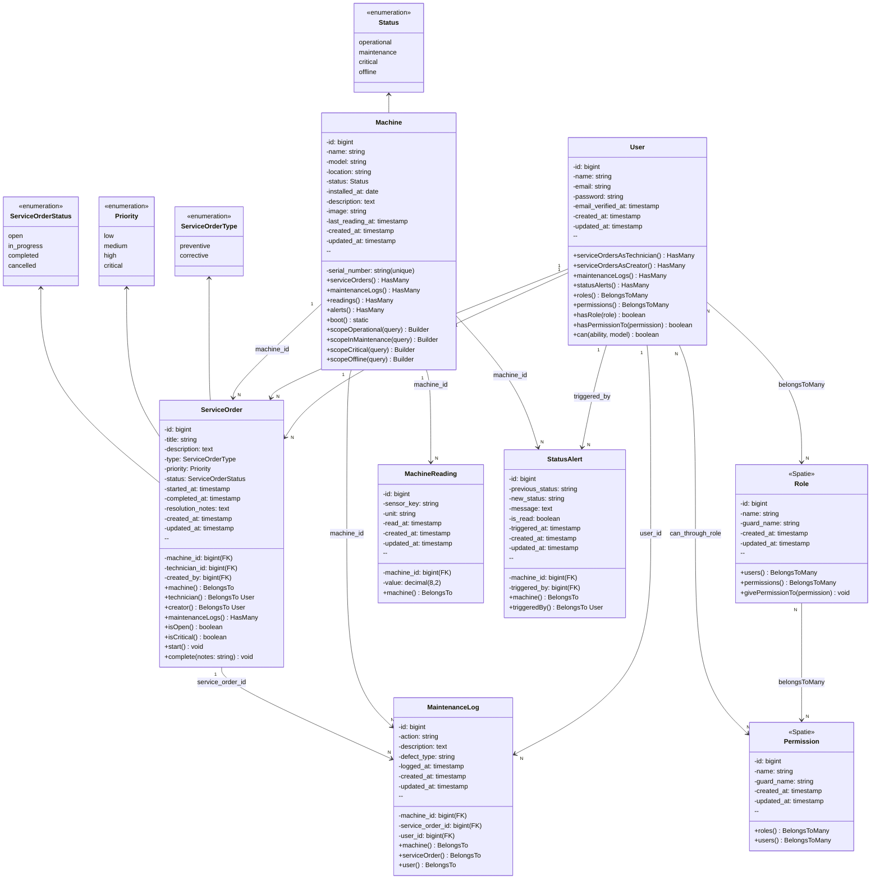

# 🏗️ Diagrama de Classes — MaintSys

## 📊 Visão Geral UML



---

## 📋 Descrição Detalhada de Classes

### 👤 **User** (Laravel)

**Responsabilidade:** Representar usuários do sistema com roles e permissões

**Atributos:**
- `id`: PK
- `name`: Nome completo
- `email`: Email único
- `password`: Hash bcrypt
- `email_verified_at`: Data verificação
- `created_at`, `updated_at`: Timestamps

**Relacionamentos:**
- `1-N` ServiceOrder (technician_id)
- `1-N` ServiceOrder (created_by)
- `1-N` MaintenanceLog
- `1-N` StatusAlert (triggered_by)
- `N-N` Role (Spatie)
- `N-N` Permission (Spatie)

**Métodos:**
- `hasRole(string $role): bool` — Verifica se tem role
- `hasPermissionTo(string $permission): bool` — Spatie permission check
- `can(string $ability, Model $model): bool` — Check autorização
- `serviceOrders()` — O.S. como técnico
- `createdServiceOrders()` — O.S. criadas por este user

---

### 🛡️ **Role** (Spatie)

**Responsabilidade:** Definir roles (admin, gerente, técnico, operador)

**Constantes:**
```
ADMIN = 'admin'
GERENTE = 'gerente'
TECNICO = 'tecnico'
OPERADOR = 'operador'
```

**Atributos:**
- `id`: PK
- `name`: Nome do role
- `guard_name`: 'web' (padrão)

**Relacionamentos:**
- `N-N` User
- `N-N` Permission

---

### 🔐 **Permission** (Spatie)

**Responsabilidade:** Definir permissões granulares

**Constantes:**
```
MACHINE_CREATE = 'machine.create'
MACHINE_UPDATE = 'machine.update'
MACHINE_DELETE = 'machine.delete'
... (1 por ação por recurso)
```

**Atributos:**
- `id`: PK
- `name`: Nome da permission
- `guard_name`: 'web'

**Relacionamentos:**
- `N-N` Role
- `N-N` User (direto)

---

### 🏢 **Machine**

**Responsabilidade:** Representar máquinas industriais no sistema

**Atributos:**
- `id`: PK
- `serial_number`: Código único (SN-2024-001)
- `name`: Nome da máquina
- `model`: Modelo/tipo
- `location`: Localização (ex: Galpão A - Linha 3)
- `status`: Enum (operational, maintenance, critical, offline)
- `installed_at`: Data de instalação
- `description`: Descrição (nullable)
- `image`: Caminho imagem (nullable)
- `last_reading_at`: Última leitura de sensor

**Relacionamentos:**
- `1-N` ServiceOrder
- `1-N` MaintenanceLog
- `1-N` MachineReading
- `1-N` StatusAlert

**Scopes:**
- `operational()` — WHERE status = 'operational'
- `inMaintenance()` — WHERE status = 'maintenance'
- `critical()` — WHERE status = 'critical'
- `offline()` — WHERE status = 'offline'

**Boot Hook:**
```php
protected static function boot() {
    parent::boot();
    static::updating(function ($machine) {
        if ($machine->isDirty('status')) {
            // Cria StatusAlert automaticamente
            // Envia Filament Notification
        }
    });
}
```

---

### 📋 **ServiceOrder**

**Responsabilidade:** Rastrear ordens de manutenção

**Atributos:**
- `id`: PK
- `machine_id`: FK → Machine
- `technician_id`: FK → User (técnico assignado)
- `created_by`: FK → User (gerente criador)
- `title`: Título da O.S.
- `description`: Descrição completa
- `type`: Enum (preventive, corrective)
- `priority`: Enum (low, medium, high, critical)
- `status`: Enum (open, in_progress, completed, cancelled)
- `started_at`: Quando técnico iniciou
- `completed_at`: Quando concluída
- `resolution_notes`: Notas de resolução

**Relacionamentos:**
- `1-1` Machine
- `1-1` User (technician)
- `1-1` User (creator)
- `1-N` MaintenanceLog

**Métodos:**
- `isOpen(): bool` — status === 'open'
- `isCritical(): bool` — priority === 'critical'
- `start(): void` — Muda para in_progress
- `complete(string $notes): void` — Conclui com notas

**State Machine:**
```
open → in_progress → completed
       ↓
       cancelled
```

---

### 📝 **MaintenanceLog**

**Responsabilidade:** Registrar histórico de todas as intervenções

**Atributos:**
- `id`: PK
- `machine_id`: FK → Machine
- `service_order_id`: FK → ServiceOrder (nullable)
- `user_id`: FK → User (técnico que registrou)
- `action`: Ação realizada (ex: "Troca de correia")
- `description`: Descrição detalhada
- `defect_type`: Tipo de defeito (ex: "Desgaste") para análise
- `logged_at`: Quando registrado

**Relacionamentos:**
- `1-1` Machine
- `1-1` ServiceOrder (nullable)
- `1-1` User

**Índices:**
- `machine_id` — para queries por máquina
- `defect_type` — para análise de padrões
- `logged_at` — para range queries

---

### 📊 **MachineReading**

**Responsabilidade:** Armazenar leituras de sensores (presente e futuro MQTT)

**Atributos:**
- `id`: PK
- `machine_id`: FK → Machine
- `sensor_key`: Tipo de sensor (temperature, vibration, rpm, pressure)
- `value`: Valor lido (ex: 42.5)
- `unit`: Unidade (°C, mm/s, RPM, bar)
- `read_at`: Timestamp da leitura

**Relacionamentos:**
- `1-1` Machine

**Exemplos:**
```
sensor_key: 'temperature', value: 42.5, unit: '°C'
sensor_key: 'vibration', value: 2.3, unit: 'mm/s'
sensor_key: 'rpm', value: 1500, unit: 'RPM'
sensor_key: 'pressure', value: 3.2, unit: 'bar'
```

---

### 🚨 **StatusAlert**

**Responsabilidade:** Rastrear e notificar mudanças de status

**Atributos:**
- `id`: PK
- `machine_id`: FK → Machine
- `triggered_by`: FK → User (nullable)
- `previous_status`: Status anterior
- `new_status`: Status novo
- `message`: Mensagem descritiva
- `is_read`: Se gerente já leu
- `triggered_at`: Quando criado

**Relacionamentos:**
- `1-1` Machine
- `1-1` User (triggered_by, nullable)

**Trigger:** Automático via Boot Hook de Machine

**Exemplo:**
```
machine_id: 1
previous_status: 'operational'
new_status: 'critical'
message: 'Máquina 04 mudou de operational para critical'
is_read: false
triggered_at: 2026-04-03 14:30:45
```

---

## 🔗 Relacionamentos Resumo

```
┌─────────┐
│  User   │ ──1-N──→ ServiceOrder (technician_id)
│         │ ──1-N──→ ServiceOrder (created_by)
│         │ ──1-N──→ MaintenanceLog
│         │ ──1-N──→ StatusAlert
│         │ ──N-N──→ Role
│         │
└─────────┘
    ↑
    │ N-N (Spatie)
    │
┌─────────┐
│  Role   │ ──N-N──→ Permission
│         │
└─────────┘

┌─────────┐
│ Machine │ ──1-N──→ ServiceOrder
│         │ ──1-N──→ MaintenanceLog
│         │ ──1-N──→ MachineReading
│         │ ──1-N──→ StatusAlert
│         │
└─────────┘

┌──────────────┐
│ServiceOrder  │ ──1-N──→ MaintenanceLog
│              │
└──────────────┘
```

---

## 📊 Tabela de Multiplicidade

| Origem | Destino | Multiplicidade | Tipo FK |
|--------|---------|---|---|
| User | ServiceOrder (tech) | 1:N | technician_id |
| User | ServiceOrder (creator) | 1:N | created_by |
| User | MaintenanceLog | 1:N | user_id |
| User | StatusAlert | 1:N | triggered_by |
| Machine | ServiceOrder | 1:N | machine_id |
| Machine | MaintenanceLog | 1:N | machine_id |
| Machine | MachineReading | 1:N | machine_id |
| Machine | StatusAlert | 1:N | machine_id |
| ServiceOrder | MaintenanceLog | 1:N | service_order_id |
| Role | User | N:N | (pivot: role_user) |
| Role | Permission | N:N | (pivot: role_has_permissions) |
| Permission | User | N:N | (pivot: model_has_permissions) |

---

## 🎨 Padrões de Design

### Repository Pattern (possível implementação futura)
```
├── Repositories/
│   ├── MachineRepository
│   ├── ServiceOrderRepository
│   └── MaintenanceLogRepository
```

### Service Layer (possível implementação futura)
```
├── Services/
│   ├── ServiceOrderService
│   ├── MachineService
│   └── AlertService
```

### Policy Pattern (implementado)
```
├── Policies/
│   ├── MachinePolicy
│   ├── ServiceOrderPolicy
│   ├── MaintenanceLogPolicy
│   └── StatusAlertPolicy
```

---

*Diagrama de Classes — MaintSys v1.0*
*Completo com todos os relacionamentos, atributos e métodos*
*2026-04-03*
