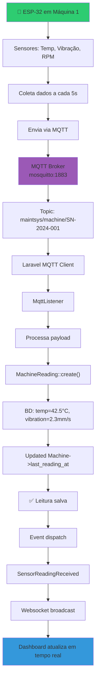
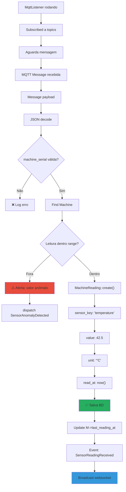
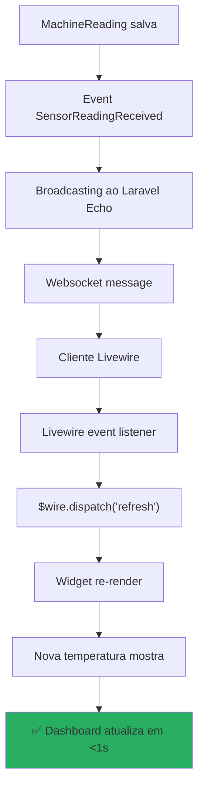

# 📡 Fluxo de Conexão MQTT (IoT - Futuro)

## 🔌 Arquitetura: ESP-32 → MQTT → Laravel



---

## 📨 Payload MQTT Esperado

```json
{
  "machine_id": "SN-2024-001",
  "sensors": {
    "temperature": 42.5,
    "vibration": 2.3,
    "rpm": 1500,
    "pressure": 3.2
  },
  "timestamp": "2026-04-03T14:30:45Z"
}
```

**Topic estrutura:**
```
maintsys/machine/{machine_serial}/sensors
maintsys/machine/{machine_serial}/status
maintsys/alert/critical
```

---

## 🖥️ Laravel Side: Listener MQTT



---

## 🚨 Fluxo: Detecção Automática de Anomalia

```mermaid
flowchart TD
    A["Leitura arrives via MQTT"] --> B["temperature = 85°C"]
    B --> C{threshold_max?}
    C -->|Sim: > 80°C| D["⚠️ Temperatura crítica"]
    D --> E["EventListener dispara"]
    E --> F["Check Machine status"]
    F --> G{Status já crítico?}
    G -->|Sim| H["Só log"]
    G -->|Não| I["Machine->status = 'critical'"]
    I --> J["Boot hook:]
    J --> K["StatusAlert::create()"]
    K --> L["message = 'Máquina X temperatura 85°C'"]
    L --> M["Notification enviada"]
    M --> N["Gerente vê alerta urgente"]

    style D fill:#e74c3c
    style N fill:#e74c3c
```

---

## 📊 Dashboard Real-Time com Websockets



---

## 📈 Exemplo: Widget com Sensor Data

```php
// App/Filament/Widgets/RealtimeSensorWidget.php

class RealtimeSensorWidget extends Widget
{
    public Machine $machine;

    public function getChartData()
    {
        return $this->machine
            ->readings()
            ->where('sensor_key', 'temperature')
            ->where('read_at', '>', now()->subHours(1))
            ->orderBy('read_at')
            ->get();
    }

    // Livewire listener para atualizar em tempo real
    #[On('sensor-reading-received')]
    public function refreshData()
    {
        $this->dispatch('refresh');
    }
}
```

---

## 🔧 Configuração MQTT no .env

```env
MQTT_HOST=mosquitto
MQTT_PORT=1883
MQTT_USERNAME=maintsys_user
MQTT_PASSWORD=secure_password
MQTT_PROTOCOL=tcp

# Topics a subscrever
MQTT_TOPIC=maintsys/machine/+/sensors
MQTT_ALERT_TOPIC=maintsys/alert/critical

# Thresholds de anomalia
SENSOR_TEMP_MAX=80
SENSOR_TEMP_MIN=5
SENSOR_VIBRATION_MAX=5
```

---

## 🎯 Fluxo Completo: ESP-32 → Alert → Dashboard


---

## 📋 Checklist: Implementação MQTT

- [ ] Instalar Mosquitto MQTT Broker (Docker)
- [ ] Instalar `php-mqtt/client` via composer
- [ ] Criar MqttListener command
- [ ] Registrar listener em schedule/kernel
- [ ] Configurar topics no .env
- [ ] Criar MachineReading migration se não existir
- [ ] Implementar SensorReadingReceived event
- [ ] Criar listeners para eventos
- [ ] Broadcast com Laravel Echo + Websockets
- [ ] Criar widget com gráfico real-time
- [ ] Testar com ESP-32 simulado (MQTT.fx)
- [ ] Documentar thresholds de alerta

---

## 🧪 Testing com MQTT.fx

```bash
# 1. Conectar a mosquitto
mosquitto_sub -h localhost -t "maintsys/machine/+/sensors"

# 2. Enviar testamento (em outro terminal)
mosquitto_pub -h localhost \
  -t "maintsys/machine/SN-2024-001/sensors" \
  -m '{"temperature":42.5,"vibration":2.3,"rpm":1500}'

# 3. Verificar BD
select * from machine_readings where machine_id = 1 order by read_at DESC limit 5;
```

---

*[[DIAGRAMAS]] | [[_Fluxogramas/Fluxo-Status-Alert]] | [[Deploy]]*
