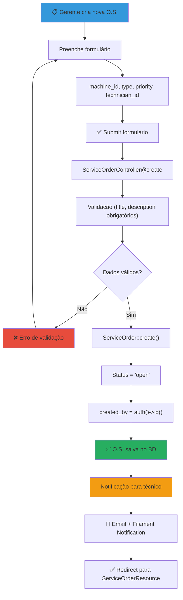
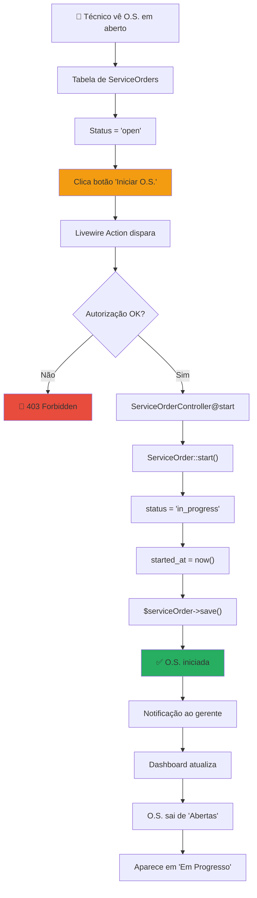
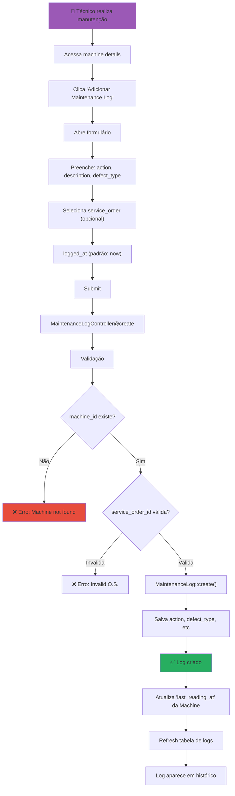
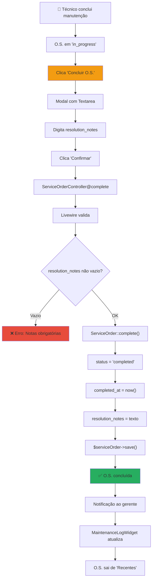
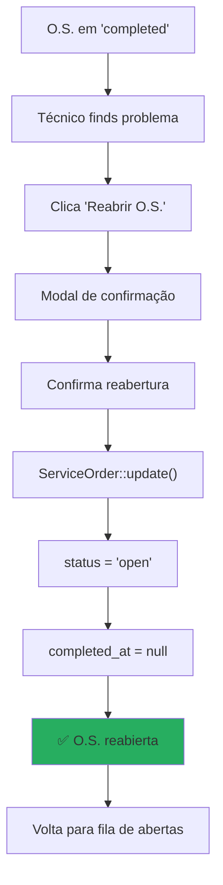
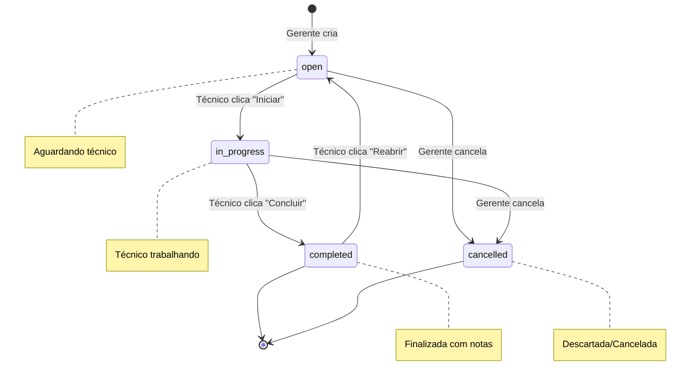

# 🔧 Fluxo de Ordem de Serviço (Manutenção)

## 🎯 Fluxo Completo de O.S.

---

## ⏱️ Fluxo: Técnico Inicia O.S.

---

## 📝 Fluxo: Criar Maintenance Log

---

## ✅ Fluxo: Concluir O.S.

---

## 🔄 Fluxo Alternativo: Técnico Reabre O.S.

---

## 📊 Status Diagrama (State Machine)

---

*[[DIAGRAMAS]] | [[_Fluxogramas/Fluxo-Autenticacao]] | [[_Fluxogramas/Fluxo-Status-Alert]]*
