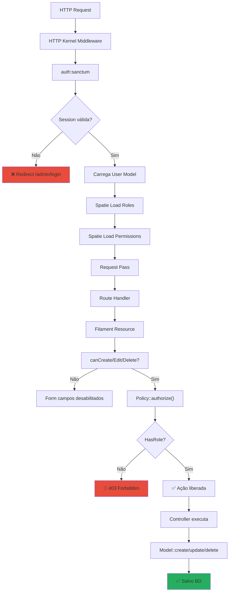
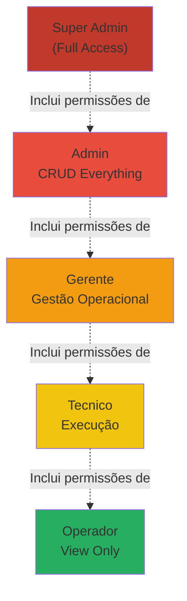
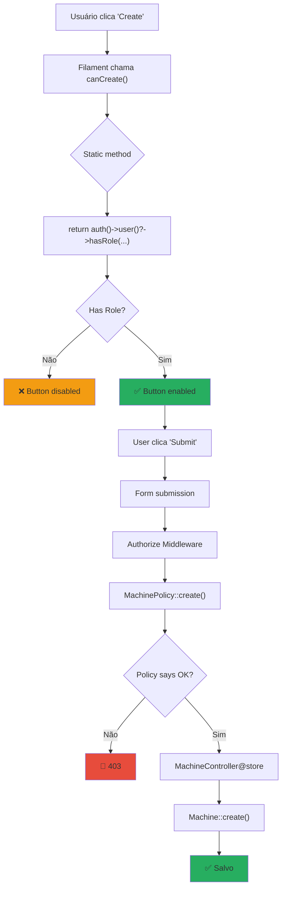
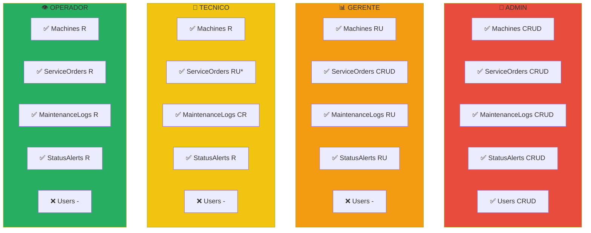
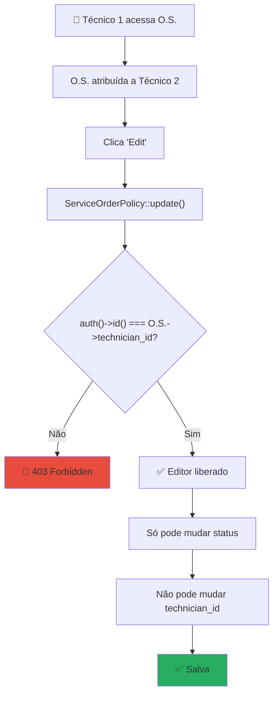
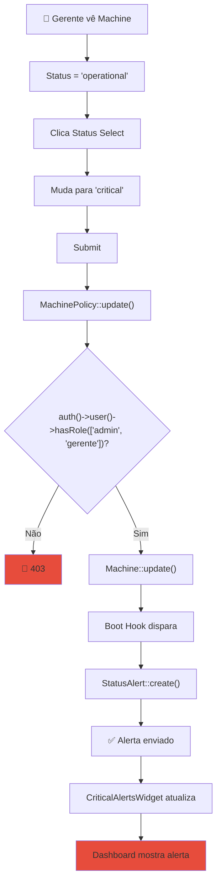

# 🛡️ Fluxo de Autorização e Permissões

## 🔐 Middleware Stack: Request → Authorization



---

## 👤 Role Hierarchy



---

## 📊 Fluxo: Verificação de Permissão em Resource



---

## 🎭 Matrix: Roles vs Resources



**Legenda:** C=Create, R=Read, U=Update, D=Delete, `-`=Sem acesso, `*`=Restrições

---

## 🎯 Fluxo: Técnico Só Edita Próprias O.S.



---

## 📱 Fluxo: Proteger Ação em Tabela

```mermaid
flowchart TD
    A["Tabela ServiceOrders"] --> B["Colunas com Actions"]
    B --> C["Edit, Delete, etc"]
    C --> D["Filament renderiza ações"]
    D --> E{"canEdit()?"}
    E -->|Não| F["Ícone Edit desabilitado"]
    E -->|Sim| G{canDelete()?}
    G -->|Não| H["Delete hidden"]
    G -->|Sim| I["Ambos disponíveis"]
    I --> J["User clica Edit"]
    J --> K["Modal abre"]
    K --> L["Policy valida de novo"]
    L --> M{Autorizado?}
    M -->|Não| N["Modal error"]
    M -->|Sim| O["Campos editáveis"]

    style F fill:#f39c12
    style H fill:#f39c12
    style O fill:#27ae60
```

---

## 🔄 Fluxo: Gerente Muda Status de Machine



---

## 🧪 Test Checklist: Autorização

```mermaid
graph TD
    T1["Login como Admin<br/>✅ Pode criar Máquina"]
    T2["Login como Gerente<br/>✅ Pode criar Máquina"]
    T3["Login como Técnico<br/>❌ Não pode criar Máquina"]
    T4["Login como Operador<br/>❌ Não pode criar nada"]

    T5["Técnico vê O.S. de outro<br/>✅ Pode visualizar"]
    T6["Técnico tenta editar O.S. alheio<br/>❌ 403 Forbidden"]
    T7["Técnico edita própria O.S.<br/>✅ Salva"]

    T8["Operador vê Dashboard<br/>✅ Dados carregam"]
    T9["Operador tenta editar Máquina<br/>❌ Botão desabilitado"]

    T10["Admin vê Users<br/>✅ Listagem"]
    T11["Gerente acessa Users<br/>❌ 403 Forbidden"]

    style T1 fill:#27ae60
    style T3 fill:#e74c3c
    style T6 fill:#e74c3c
    style T11 fill:#e74c3c
```



---

## 📋 Gates vs Policies

| Situação | Usar | Exemplo |
|----------|------|---------|
| Ação global | **Gate** | `Gate::allows('admin')` |
| Recurso específico | **Policy** | `$policy->update($user, $model)` |
| Check simples | **Gate** | `can('view_dashboard')` |
| Lógica complexa | **Policy** | Policy methods |

```php
// Gate (global)
Gate::define('admin-only', function (User $user) {
    return $user->hasRole('admin');
});

// Policy (model-specific)
class MachinePolicy {
    public function update(User $user, Machine $machine) {
        return $user->hasAnyRole(['admin', 'gerente']);
    }
}

// Usage
if (Gate::allows('admin-only')) { }
if ($user->can('update', $machine)) { }
```

---

*[[DIAGRAMAS]] | [[_Fluxogramas/Fluxo-MQTT]] | [[Arquitetura-Tecnica]]*
