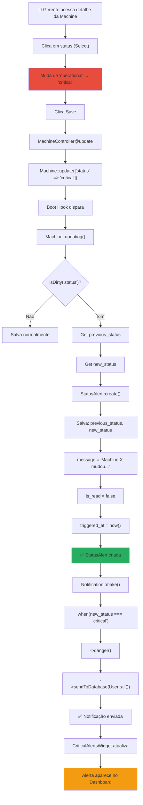
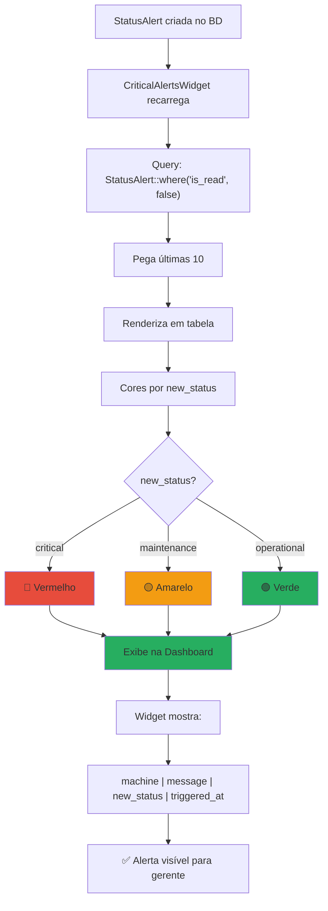
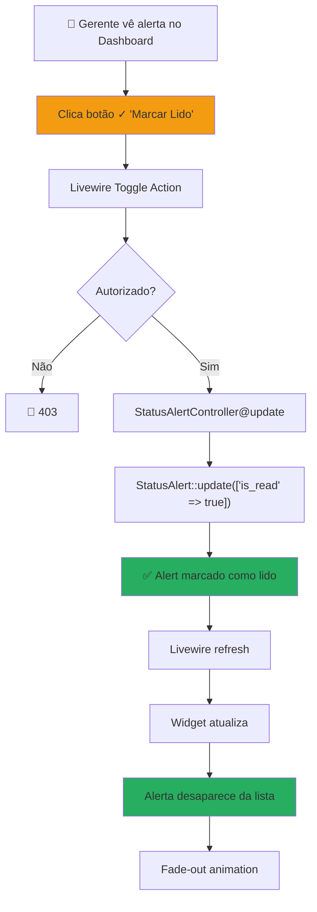
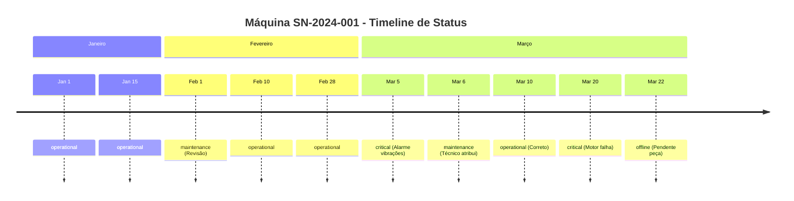

# 🚨 Fluxo de Alertas de Status

## 🔴 Fluxo: Mudança de Status da Máquina

---

## 📱 Fluxo: Alerta Aparece no Dashboard

---

## ✅ Fluxo: Marcar Alerta como Lido

---

## 🔄 Fluxo Completo: Machine Status Change → Alert → Dashboard

---

## 📊 Timeline: Status Transitions

---

## 🎯 Matrix: Quando Alertas São Criados

| De | Para | Alerta | Cor | Notificação |
|----|------|--------|-----|-------------|
| operational | maintenance | ✅ | Amarelo | ✅ |
| operational | critical | ✅ | Vermelho | ✅✅ (urgente) |
| operational | offline | ✅ | Cinza | ✅ |
| maintenance | operational | ✅ | Verde | ✅ |
| maintenance | critical | ✅ | Vermelho | ✅✅ |
| critical | operational | ✅ | Verde | ✅ |
| critical → critical | ❌ | — | — | ❌ (sem mudança) |

---

*[[DIAGRAMAS]] | [[_Fluxogramas/Fluxo-Ordem-Servico]] | [[_Fluxogramas/Fluxo-MQTT]]*
